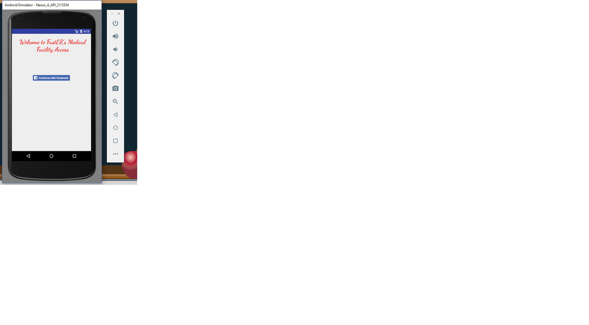
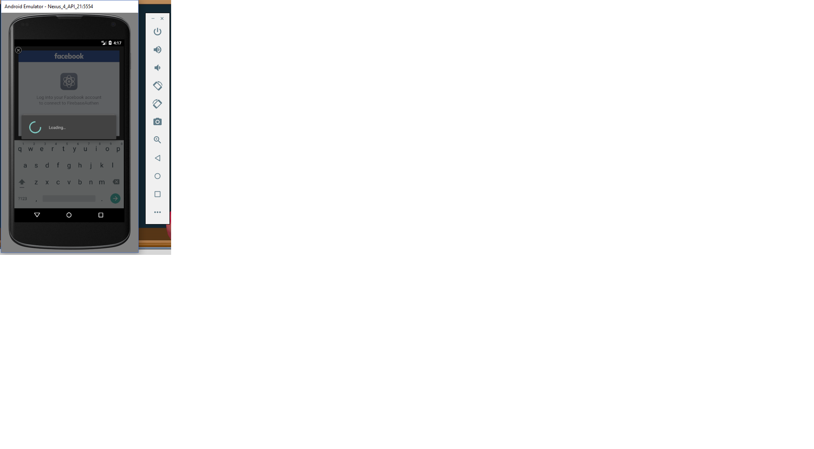
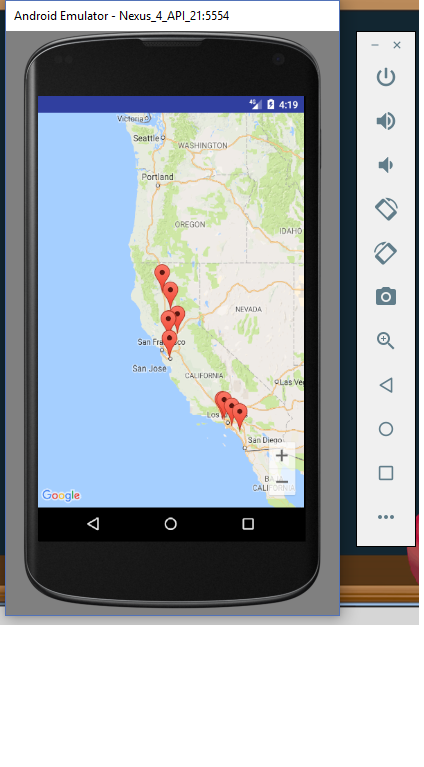
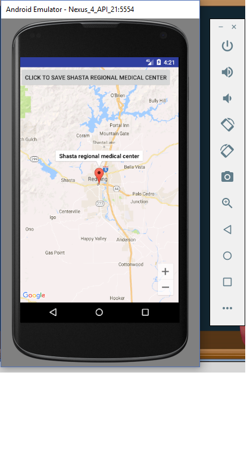
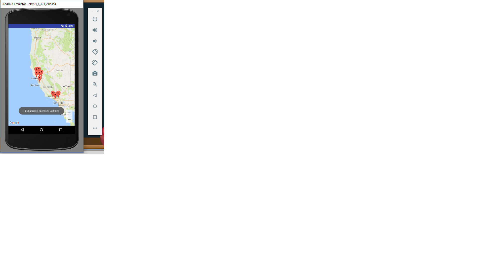
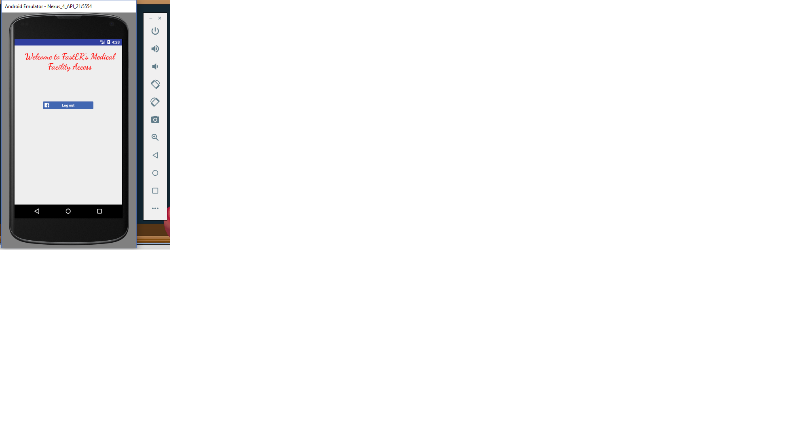

# Googlemaps-
Used googlemaps and firebase in android sdk

This project saves medical facility preference in database online.
Authentication is done using Facebook. It gives you how many times a faciltiy has been accessed.
After the data is saved new locations are displayed.

